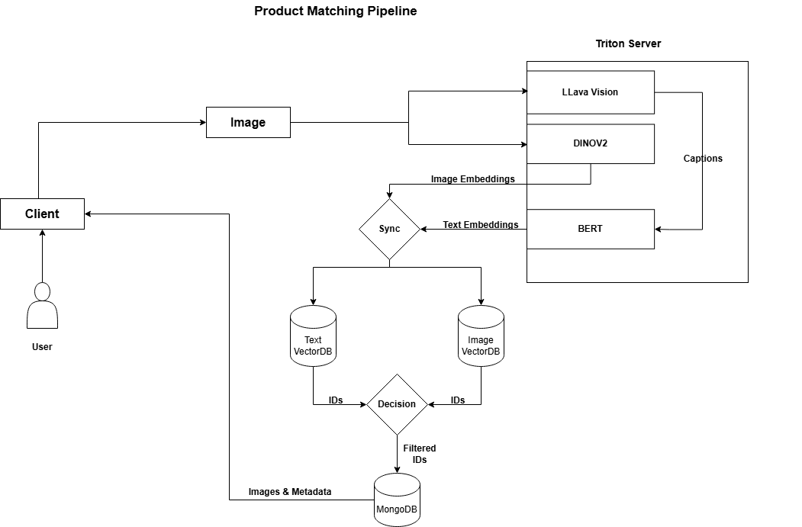

# LLMs-Powered Product Matching Pipeline

*A multimodal image and text-based product matching system using BERT, DINOv2, and LLaVA.*

 **Motivation:** Inspired by research in vision-language models and large-scale product matching.

# Overview:

This project is a fast, scalable, and efficient product matching system that leverages multimodal inputs—both text and images—to perform semantic similarity search. It's optimized using NVIDIA Triton Inference Server and integrates state-of-the-art models like DINOv2, BERT, and LLaVA for rich embeddings and captioning.

---

## Models Used

- **DINOv2** – Generates Image Embeddings  
- **BERT** – Generates text embeddings  
- **LLaVA-OneVision** – Captioning Input Image

---

## Tech Stack

-  **FastAPI** – Backend API  
-  **Gradio** – Web Frontend GUI  
-  **Triton Inference Server** – TensorRT Optimized model deployment  
-  **FAISS** – Vector Database
-  **MongoDB** – Stores metadata (Including Images)  
-  **Docker Compose** – Orchestrates all Containers
---

## Features

- Supports **Image** or **Text** based Semantic Search
- TensorRT-powered inference via **Triton**
- FAISS + MongoDB integration for embeddings & metadata Storage
- Easy-to-use **Gradio UI**
---
## Project Structure

```
├── LICENSE
├── README.md
├── assets
│   ├── workflow.drawio
│   └── workflow.drawio.png
├── backend
│   ├── __init__.py
│   ├── batching
│   │   ├── __init__.py
│   │   └── base.py
│   ├── core
│   │   ├── __init__.py
│   │   ├── app_state.py
│   │   ├── config_loader.py
│   │   └── custom_log.py
│   ├── database
│   │   ├── __init__.py
│   │   ├── faiss_db.py
│   │   └── mongo_db.py
│   ├── models
│   │   ├── __init__.py
│   │   ├── bert_model.py
│   │   ├── dinov2_model.py
│   │   └── llava_model.py
│   ├── routes
│   │   ├── __init__.py
│   │   ├── api_router.py
│   │   ├── image_search.py
│   │   ├── logger.py
│   │   └── text_search.py
│   ├── services
│   │   ├── __init__.py
│   │   ├── img_vector_search.py
│   │   ├── llava_bert.py
│   │   ├── llava_runner.py
│   │   ├── mongodb.py
│   │   ├── text_vector_search.py
│   │   └── triton_client.py
│   └── utils
│       ├── __init__.py
│       ├── logging.py
│       └── rerank.py
├── main.py
│ 
├── configs
│   └── app_config.yaml
├── dataset
│   ├── sample
│   │   └── images
│   ├── deepfashion_loader.py
│   └── prepare_metadata.py
├── db
│   ├── faiss
│   │     ├── bert_index.faiss
│   │     └── dino_index.faiss
│   └── mongo
│        └── metadata.json
├── docker         
│      ├── Dockerfile.backend
│      ├── Dockerfile.mongo
│      └── Dockerfile.triton
│
├── frontend
│   └─── app.py
│
├── engines
│   ├── bert
│   │   ├── 1
│   │   │   └── model.plan
│   │   ├── bert.onnx
│   │   └── config.pbtxt
│   ├── dinov2
│   │   ├── 1
│   │   │   └── model.plan
│   │   ├── config.pbtxt
│   │   └── dinov2.onnx
│   └── llava_to_bert
│       ├── 1
│       │   └── model.py
│       └── config.pbtxt
├── llava_vision
│   ├── config.json
│   └── rank0.engine
└── llava_vision_encoder
    ├── config.json
    ├── image_newlines.safetensors
    └── model.engine

├── scripts     
│    ├── bert_onnx_convert.py
│    ├── dinov2_onnx_convert.py
│    ├── download_build_llava.sh
│    ├── test.jpg
│    └── test_triton_client.py
├── trt_engine       
│     ├── __init__.py
│     ├── bert_engine.py
│     ├── dinov2_engine.py
│     ├── llava_engine.py
│     ├── llava_utils.py
│     └── trt_base.py
│
├── docker-compose.yaml
├── requirements_app.txt
└── requirements_server.txt
```
---

## Workflow


---

## Dataset – DeepFashion

We use a **subset of the DeepFashion dataset** around 2k fashion product images:

- High-resolution product images  
- Product metadata (title, description, category)  
- Fine-grained attributes  
- [DeepFashion Dataset Info](http://mmlab.ie.cuhk.edu.hk/projects/DeepFashion.html)
---

## Token Limit Notice:
+ Text input is limited to a maximum of 128 tokens.
+ All input texts are tokenized using **bert-base-uncased**.
+ Inputs longer than 128 tokens will be automatically truncated.

**Note:** For best results, keep prompts short, focused, and within 1–2 sentences.
## Triton Platform Specs:
+ GPU: NVIDIA GeForce RTX 4090 (24GB VRAM)
+ CUDA: Version 12.8
+ Driver: 570.124.06
+ CUDA Compiler: 12.6
+ CPU: AMD EPYC 7282, 16-Core

## ⚡ Quick Start Guide

### * Prerequisites:

```bash
- Docker
- NVIDIA GPU (for Triton inference)
- Python 3.8+ (for any local testing)

```

### 1. Clone the Repo
```bash
git clone https://github.com/sudheer-akki/product-matching-pipeline
cd /product-matching-pipeline
```

### 2. Download ONNX Models & Sample Database

```
bash download_models.sh
```
**Note:** Make sure the following files are downloaded and in place:

+ bert_onnx -> models/engines/bert/bert.onnx
+ dino_onnx -> models/engines/dinov2/dino.onnx
+ bert index -> db/faiss/bert.index
+ dino index -> db/faiss/dinov2.index
+ MongoDB Metadata -> db/mongo/metadata.json

### 3. Update configuration data

+ open **configs/app_config.yaml** file

**Note:** Update values if needed

### 4. Start the Application (Docker)

```
docker compose up -d
```
This command will automatically:

+ Build Docker engines for each model if not already present.

+ Start the Triton Inference Server with all necessary backends and dependencies.

### Access the Frontend GUI: http://localhost:7860

## 5. Upload Image
+ Open the GUI in your browser.
+ Upload an image from the **dataset/sample** folder.
+ Check the output results for product matches!

## Demo

Watch a short demo of the Product Matching Pipeline in action:  
📺 [Click to Watch on Google Drive](https://drive.google.com/file/d/1HMTTXWTheWwC-zN2QKnYVv3Cr8a9dBPi/view?usp=drive_link)

This video includes:
- Launching the web UI
- Uploading a sample product image
- Retrieving visually and semantically similar matches
- Real-time inference using Triton

## Support

If you face any issues using this repository, feel free to [open an Issue](https://github.com/your-username/product-matching-pipeline/issues).  
I’ll be happy to help troubleshoot and provide guidance.

If you find this project useful, please consider giving it a ⭐ on GitHub!

## Areas for Improvement

While this system is production-ready and functional, there is **room for improvement** in two key areas:

- **Product Matching Ranking** – Current ranking works well but can be further refined to improve accuracy, especially in visually or semantically similar product groups.
- **Code Optimization** – Certain components (e.g., batching, async inference, reranking logic) can be optimized for performance and efficiency.

These areas are open-ended and can be enhanced depending on specific use cases or deployment needs.


## License

This project is licensed under the [MIT License](LICENSE).
